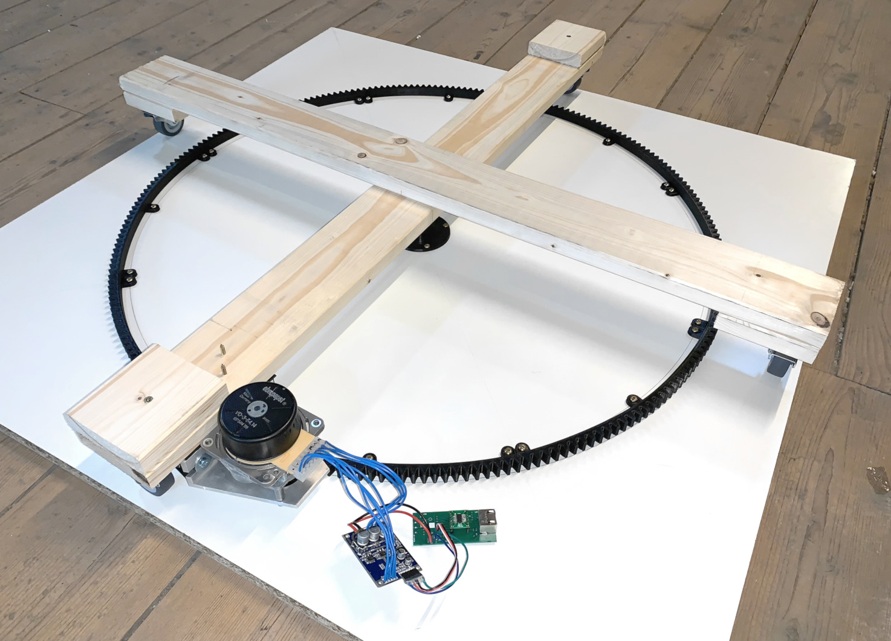

# Turntable
Construction of a low-cost turntable positioner including 3D-printable parts and software to control it.

## Construction
3D-printable parts and assembly.

## Firmware
Quick-and-dirty mash-up of the [StepperDrive controller board](https://github.com/EMS-TU-Ilmenau/StepperDrive) and cheap e-Bike brushless motor controller (with hall sensor inputs).

## Interface
Python interface to talk to the firmware and do the steps to degree conversions.