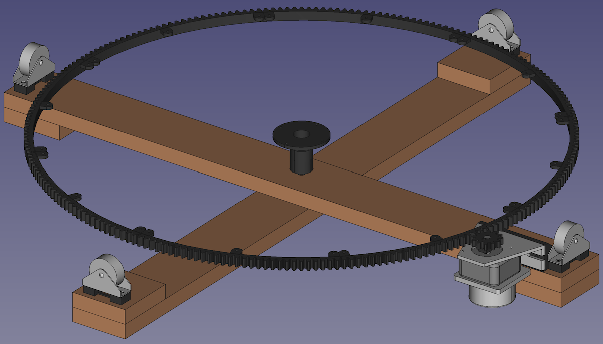

# Turntable
Construction of a low-cost turntable positioner including 3D-printable parts and software to control it.

## Dependencies
### Drivetrain control
While the table could be driven by a wide range of motors, the construction was planned in mind with a stepper motor controlled by [StepperDrive](https://github.com/EMS-TU-Ilmenau/StepperDrive).

### Construction
The individual parts are made using FreeCAD.

The assembly was made poorly using the A2plus workbench, which can be installed via the Addon-Manager.