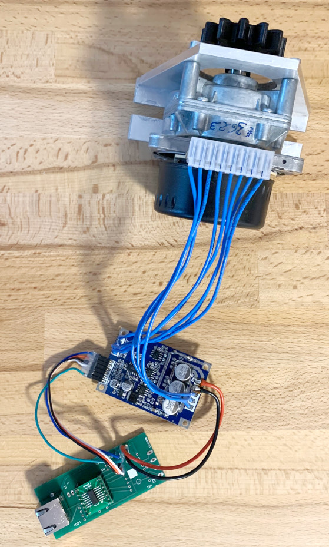

# TurnTableDrive
Firmware to control the motor

This is basically a quick-and-dirty mash-up of the [StepperDrive controller board](https://github.com/EMS-TU-Ilmenau/StepperDrive) and cheap e-Bike brushless motor controller (with hall sensor inputs) which takes an analog level as input for speed and outputs a tacho pulse TTL signal.

This firmware is very basic. It just counts the tacho pulses to get the step position (12 changing edges per rotor revolution * 38.6 motor gear ratio * 20 table gear ratio = 9264 steps per table revolution) and generates a high frequency PWM (that is filtered by the RC lowpass on the brushless motor controller board) to adjust speed.

## Getting started
The firmware uses the same hardware and baudrate as the [StepperDrive controller board](https://github.com/EMS-TU-Ilmenau/StepperDrive). That means it can be connected to the hub board as well. Depending on the used motor, the 12V power supply on the hub may be replaced by something more powerful.

### Commands
The following SCPI-like commands can be used with the firmware (see StepperDrive for more details):
- `AXn:VEL [speed]`: where speed can be -1000...1000 to set a relative motor power and direction
- `AXn:POS?`: requests the current step position (accumulated tacho pulses)
- `AXn:POS [defined step position]`: sets the accumulated tacho pulses to a new value, i.e. the current step position is redefined. **This does NOT drive to a certain position**
- `AXn:PER?`: requests the last period between two steps in us, divided by 128. So the response must be multiplied by 128 to get the period in microseconds. **Note:** when the motor is at very slow speed or it stops, this value gets crazy due to overflow.